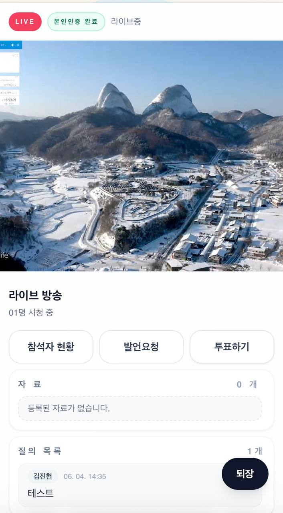
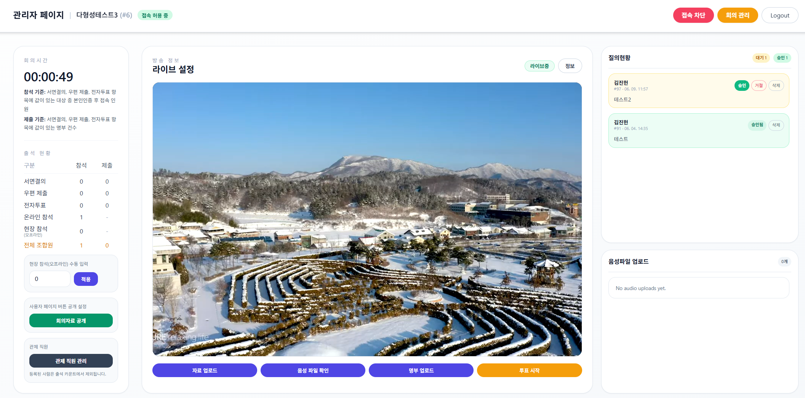

# 온라인 총회 — 라이브 스트리밍 / 출석·투표 플랫폼

조합 총회를 온라인으로 진행하기 위해 개발한 서비스입니다. 조합원이 원격에서 총회를 실시간으로 시청하고,
본인인증을 거쳐 안건에 투표합니다.

이 서비스의 핵심 제약은 **시청·접속 기록이 법적 자료로 활용된다**는 점입니다. 이에 따라 다음 요건을 충족해야 했습니다.

- 명부에 등록되지 않은 사람의 시청을 차단할 것
- 본인인증을 통과하지 못한 사람의 시청을 차단할 것
- 각 조합원의 시청 시작·종료 시각을 정확히 기록할 것 (총회 성립 여부 판단의 근거)

따라서 영상 송출 자체보다 **명부 기반 접근 통제, 본인인증, 정확한 출석 기록**이 핵심 과제였으며,
본 문서 또한 해당 영역을 중심으로 정리했습니다.

> 기획·백엔드·프론트엔드·인프라·배포 전 과정을 **단독 개발**했으며, 실제 운영(동시접속 약 300명)까지 수행했습니다.

## 주요 화면

**시청자 화면 (모바일)** — 본인인증 완료 후 라이브를 시청하며, 참석자 현황·발언요청·투표·자료 확인을 제공합니다.



**관리자 화면** — 라이브 송출 설정, 실시간 참여 현황, 출석 집계, 자료 업로드 등 회의 운영 도구를 제공합니다.



---

## 기술 스택

- **Backend** — Java 21, Spring Boot, Spring JDBC(JdbcTemplate)
- **Frontend** — React, Vite, Tailwind CSS
- **DB / 스트리밍** — MySQL, Wowza Streaming Engine(HLS)
- **인증** — NICE 본인인증(실명 확인)
- **인프라 / 운영** — nginx(리버스 프록시·TLS), systemd, 방화벽 하드닝, Node 기반 부하 테스트

ORM 대신 `JdbcTemplate`을 사용했습니다. 출석 집계처럼 조인과 그룹 집계가 많은 쿼리를 직접 작성·튜닝하는 편이 명확했고, 도메인 모델이 단순해 ORM의 이점이 크지 않다고 판단했기 때문입니다.

---

## 아키텍처

```
브라우저
  → nginx (TLS, 리버스 프록시)
      → Spring Boot API  : 본인인증 / 명부 / 출석 집계 / 시청 기록 워치독
      → Wowza (HLS 라이브) : /live/{key}/playlist.m3u8
      → React 정적 프론트

Spring Boot API ↔ MySQL : 명부·세션·출석 기록
```

라이브 영상은 Wowza가 HLS로 송출하고, 백엔드는 **접근 권한, 본인인증, 출석 기록**을 담당합니다.
영상 전송 경로와 인증·기록 경로를 분리하여 책임을 구분했습니다.

---

## 핵심 기능

- **명부 업로드 및 검증** — CSV/XLSX 명부를 업로드해 조합원 마스터로 등록하며, 엑셀에 삽입된 **서명 이미지까지 추출**해 보관합니다.
- **NICE 본인인증** — 명부 대조(이름·생년월일·휴대폰)를 통과한 경우에만 시청 토큰을 발급합니다.
- **HLS 라이브 시청** — 인증된 조합원만 스트림에 접근할 수 있으며, 미인증·미등록자는 차단됩니다.
- **시청·출석 기록** — 시청 시작·종료 시각과 종료 사유(정상 종료/타임아웃)를 기록합니다.
- **출석 집계** — 온라인 시청자와 현장 참석(관리자 수동 입력)을 합산합니다.
- **투표 연동** — 외부 투표 페이지로 연결하고, 명부 기반으로 투표 자격을 검증합니다. (투표 집계는 외부 시스템 담당)
- **질의응답(발언요청)** — 텍스트 또는 음성(실시간 녹음·파일 업로드)으로 질문을 보내고, 관리자 승인을 거쳐 노출됩니다.
- **부가 기능** — 자료(PDF·텍스트) 공유, 회의별 관리자 대시보드, 제외 대상자 관리.

---

## 주요 기술적 과제와 해결 방법

### 1. 불안정한 클라이언트 환경에서의 시청 기록 정확성 확보

시청 기록은 총회 성립을 판단하는 법적 근거이므로 정확해야 합니다. 그러나 브라우저는 크래시, 강제 종료, 네트워크 단절 등으로 사전 통보 없이 종료될 수 있어, 명시적 로그아웃 요청에만 의존하면 종료 시각이 부정확해집니다.

**해결 방법 — 하트비트 + 서버 사이드 워치독(reaper) 구조:**

- 클라이언트가 주기적으로 신호를 전송하여 서버의 `last_seen`을 갱신합니다.
- 탭 종료·이탈 시 `visibilitychange`와 `navigator.sendBeacon`을 사용해 **정상 종료(`browser_exit`)** 를 서버에 전달합니다.
- 서버는 `@Scheduled` 기반 리퍼를 통해 `last_seen`이 타임아웃(운영값 180초)을 초과한 세션을 **`timeout` 사유로 강제 종료**합니다. 이를 통해 클라이언트가 신호 없이 종료되더라도 종료 시각이 보존됩니다.
- 결과적으로 종료 사유가 `browser_exit`(정상)와 `timeout`(비정상)으로 구분되어 기록됩니다.

**규모 대응:** 동시접속 300명이 매 하트비트마다 DB에 기록할 경우 MySQL에 부하가 집중됩니다. 이를 방지하기 위해 `last_seen` 쓰기를 인터벌 단위로 **스로틀링(write coalescing)** 하고, 정리 작업은 `compareAndSet`으로 중복 실행을 차단했습니다.

> 관련 코드: [`ViewerAuthService`](backend/src/main/java/com/example/hlsviewer/viewer/ViewerAuthService.java)

### 2. NICE 본인인증 연동 및 암호화 직접 구현

NICE 표준창 연동은 데이터를 평문으로 송수신하지 않으므로, 다음과 같이 처리했습니다.

- **PBKDF2** 기반 대칭키 유도, **AES-GCM** 요청/응답 암복호화, **HMAC** 무결성 검증
- 인증 토큰 TTL 캐싱을 통한 불필요한 재발급 최소화
- 인증 세션에 대한 `MAX_ACTIVE_SESSIONS` 상한 및 주기적 만료 정리를 통한 메모리 누수 방지

> 관련 코드: [`NiceAuthService`](backend/src/main/java/com/example/hlsviewer/nice/NiceAuthService.java)

### 3. 엑셀 명부 내 서명 이미지 추출

조합 명부는 엑셀 셀 내부에 **서명 이미지**를 포함하는 경우가 많았습니다. 일반 라이브러리로는 셀 내 이미지를 추출하기 어려워, XLSX(zip) 내부 구조(drawing, richValue, cell image 관계)를 파싱해 셀 좌표에 이미지를 매핑하도록 구현했습니다.

> 관련 코드: [`RosterUploadService`](backend/src/main/java/com/example/hlsviewer/roster/RosterUploadService.java)

---

## 단독 개발 범위

- **백엔드** — 도메인별 패키지 설계, 본인인증·명부·출석·투표·스트리밍 API (Java 약 11k 라인)
- **프론트엔드** — 시청자 애플리케이션 및 관리자 애플리케이션 (React)
- **인프라·운영** — nginx·systemd 구성, 배포 스크립트, 방화벽 하드닝, 부하 테스트, 실제 운영
